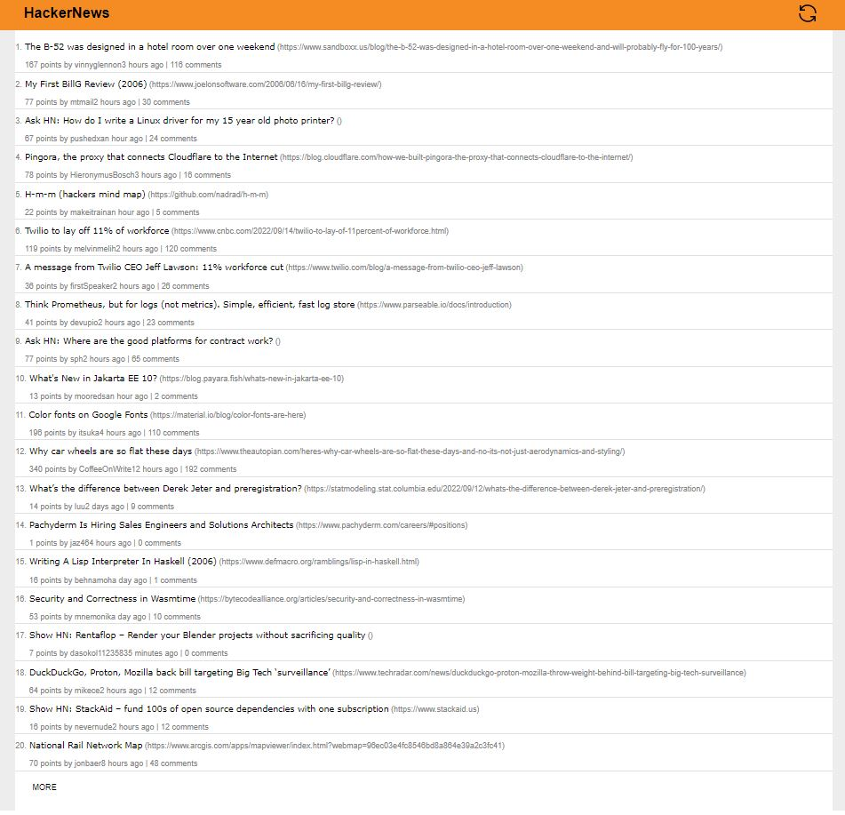

<h1 align="center">react-hacker-news</h1>

<p align="center">
 
</p>

## About 
A simple Hacker News API front page React app made with Typescript

## Running the app

```
npm install
npm start
```

### Built With
- [React](https://reactjs.org/)
- [redux-toolkit](https://redux-toolkit.js.org/)
- [Material-UI](https://mui.com/)
- [axios](https://github.com/axios/axios)
- [moment](https://momentjs.com/)
- [Hacker News API](https://hackernews.api-docs.io/v0/overview/introduction)

